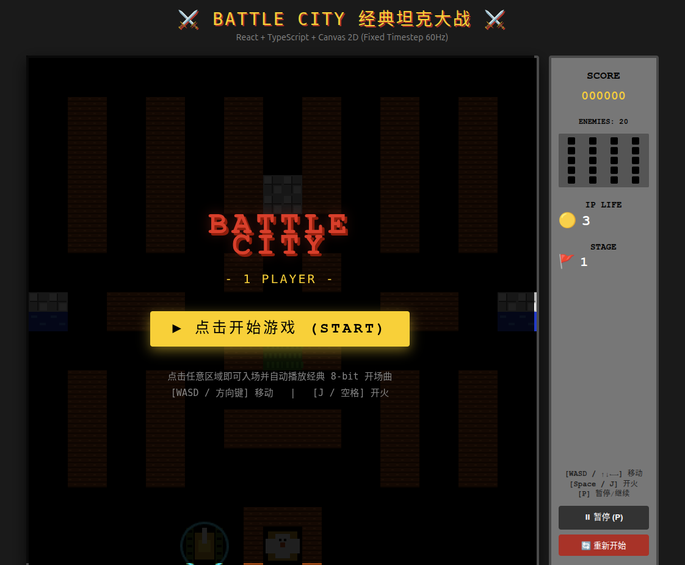

# ⚔️ React Battle City (FC 经典坦克大战)

> **本项目是一个面向 AI 编码与工程基准测试（Game Benchmark）的原型项目**，旨在考察与评估大模型在复杂状态机、预测性物理碰撞、定长步长游戏引擎、状态解耦架构、以及 100% 像素与音频深度还原维度的**自主规划与工程落地能力**。



---

## 🎯 项目背景与评测目标 (Benchmark Objective)

传统的代码生成基准测试（如 HumanEval、SWE-bench）多局限于算法函数或单文件修复，难以有效评测 AI 面对**长上下文、多子系统强耦合、高性能帧率控制及工程架构规范**时的综合决策水准。

本项目以 **FC 经典《坦克大战 (Battle City)》** 完整复刻为载体，核心考察 AI：
1. **自主规划能力 (Autonomous Planning)**：能否自行将大型游戏逻辑自顶向下拆解为 P0 ~ P4 阶段的原子性任务路线图（见 `TASKS.md`）。
2. **架构约束设计能力 (Architecture Enforcement)**：能否严格遵循前后端/UI-引擎分离规范，杜绝 React 状态污染高频游戏帧循环（见 `ARCHITECTURE.md`）。
3. **复杂机制精确实现能力 (Exact Mechanics)**：
   - 60Hz 确定性累加器定长时钟 (Fixed Timestep)；
   - 4-bit 掩码四分之一砖块局部损毁破坏模型；
   - 基于 AABB 的预测性防穿墙与拐角网格微吸附（Grid Alignment）；
   - 经典红白机 8-bit APU 音效与原版采样精确启停控制。

---

## 🕹️ 游戏在线与本地运行

### 1. 安装与启动
```bash
# 安装依赖
npm install

# 启动本地开发服务 (Vite)
npm run dev

# 构建生产版本并进行类型校验
npm run build

# 代码规范检查 (Oxlint)
npm run lint
```

### 2. 操作指南
| 按键 | 功能 |
|---|---|
| **W / A / S / D** 或 **↑ / ↓ / ← / →** | 控制坦克移动（支持拐角平滑吸附） |
| **J** 或 **Space (空格)** | 开火发射炮弹 |
| **P** | 暂停 / 继续游戏 |
| **按钮操作** | 页面右下角支持点击暂停、重新开始与换关 |

---

## 🏛️ 系统架构 (Architecture Highlights)

本项目采用**引擎驱动（Engine-Driven）**设计，严格禁止 React 涉足高频物理或实体坐标调度：

```text
[React HUD / Overlays] <--- (低频 Event Bus: 分数/生命/关卡/GameOver) --- [GameEngine]
                                                                                │
┌───────────────────────────────────────────────────────────────────────────────┘
▼
[Fixed GameLoop (60Hz)]
  ├── 1. InputSystem          (键盘输入缓冲与多键判定)
  ├── 2. EnemyAISystem        (敌人巡逻转向、朝向玩家/基地权重决策与随机开火)
  ├── 3. MovementSystem       (预测性位移验证 + Grid Alignment 网格微吸附)
  ├── 4. BulletSystem         (子弹匀速推进与生存期管理)
  ├── 5. CombatCollisionSystem(Tank×Map, Bullet×Map, Bullet×Tank, Bullet×Bullet, 基地破坏)
  ├── 6. SpawnSystem          (顶部 3 刷新点轮询、同屏上限 4 台、出生星动画与无敌帧)
  ├── 7. EffectSystem         (爆炸帧动画推进、无敌护盾光环)
  ├── 8. GameRuleSystem       (胜负判定：基地毁灭/命尽 -> GameOver, 敌人清空 -> StageClear)
  └── 9. CleanupSystem        (失效实体回收)
  │
▼
[RenderSystem] (Canvas 2D 只读渲染)
  ├── 1. 清屏 (Clear)
  ├── 2. 地图底层瓦片 (Brick, Steel, Water, Ice, Base)
  ├── 3. 坦克与炮管朝向 (PlayerTank, EnemyTank, 附带动态护盾光圈)
  ├── 4. 飞行子弹
  ├── 5. 特效 (爆炸、生成星星)
  └── 6. 顶层遮罩 (Grass 树林草地 Z-Index 顶层渲染，遮挡坦克与炮弹)
```

---

## ✨ 核心亮点与机制还原

- **砖块 4-bit 四分体破坏 (Quarter-Tile Model)**：
  将每个 16×16 px 的砖块切分为 4 个 8×8 px 的子块（`0b1111`），子弹击中边缘时按朝向精确消除对应 bit，完全还原原版击碎半块砖的射击手感。
- **预测性碰撞 (Predictive Movement)**：
  严格摒弃“先移动再纠偏”的穿墙 Bug 隐患，移动前计算 `nextRect`，与周边 9 宫格瓦片及所有活动实体比对通过后才提交位移。
- **拐角网格微吸附 (Grid Alignment)**：
  转向时自动吸附对齐到 8px/16px 轨道中心，彻底消除直角弯“卡墙角转不过去”的生硬操作感。
- **100% FC 原版 ROM 采样音效系统**：
  - 集成原版 ROM 提取的标准音效文件（开场曲、爆炸、击墙、射击、GameOver）。
  - 精确处理 Web Audio 上下文与坦克移动音效循环：坦克行驶中播放引擎声，静止/暂停/爆炸/过关时立即切断，绝不出现挂起或持续杂音。
- **经典 HUD 与 UI 交互**：
  右侧 1:1 还原红白机经典的敌方存活图标点阵、玩家剩余命数、当前关卡旗帜，并提供现代 Web 的优雅毛玻璃遮罩。

---

## 🛠️ 技术栈

- **Runtime & UI**: React 19, TypeScript, Canvas 2D API
- **State Management**: Zustand (用于会话与全局轻量状态)
- **Tooling & Build**: Vite 6, Oxlint, TypeScript 5.8+
- **Audio Engine**: Web Audio API (支持多音轨并发与循环引擎音效)

---

## 📋 自主规划进度参考

完整拆解及验收标准参见 [TASKS.md](./TASKS.md)，详细架构与硬性红线规范参见 [ARCHITECTURE.md](./ARCHITECTURE.md)。
